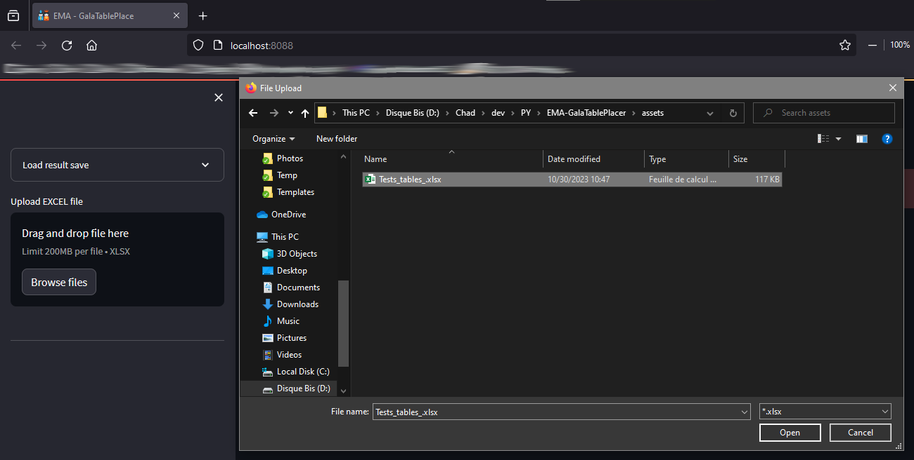

# EMA-GalaTablePlacer

This application predict a good enought table placement to satisfy those requirements:  
- Codes should be automaticaly modified by pre processing algortihme.
- Each table should be as close as possible to the friend table.  

## 📚 How to use

### [Visit this website to use this app](https://ema-galatableplacer.streamlit.app/)  

1. ### Upload your excel file.  
Upload your file on the left.  
  

2. ### Edit your data.  
You get some metrics of the data in the center.  
You can live edit data by double clicking and editing the value you want to update.  
  

3. ### Lauch the algorithm.
On the sidebar on the left you have a formular where you can edit some parameters.  
- **Size of table**: maximum size of the table.
- **Equaly split overfilled tables**: If checked an overfilled table will be splitted in equally size tables, for exemple a table of size 12 will create 2 tables of 6 people. If not checked the table will be splitted in one big table and one small table, for exemple a table of size 12 will create 1 table of 10 people and 1 table of 2 people.  
- **Number of solution to try**: The more it get, the better the result will be be the longer the run time will be.  

Click on the button calculate table placement.  
Wait for the algorithm to do the work.  

4. ### Explore your result.

You'll get a result image that shows table placement and number of each table.

You'll get some metrics of the result.

You can search information on a person or a table.

- ### Bonus: Save result.  

**You can save the result and reload it without uploading the excel data or running the algorihtme again.**
Save the result by clicking download save on the sidebad on the lef.  

Upload and load the result by opening save slider on top left and uploading the downloaded save file.  

## ⚙️ How it works
1. ### Preprocessing data
The application will first load the data and will aplly filters to normalise them.
- **Column "Prénom"**: we will lower case the text and upper case the first letter.
- **Column "Nom"**: we will upper case the text
- **Column "Code table"**: to prevent code error from users, we will relace all the none or blacklisteds values with "NOTABLE", next we will remove or replace accent and special caractere and upper case everything, finally we only keep letters and digits.
- **Column "Code table ami"**: to prevent code error from users, we will remove or replace accent and special caractere and upper case everything, finally we only keep letters and digits.  

The code is in [loader.py](src/loader.py).

2. ### Cast data to processable data for algorithm
In writing...  
The code is in [caster.py](src/caster.py).

3. ### Search solution
In writing...  
The code is in [solver.py](src/solver.py).

## 🐳 How to deploy on premise
**You'll need to have Docker and docker-compose installed.**  

Clone this git repository
> git clone git@github.com:ChadEstoupStreiff/EMA-GalaTablePlacer.git

Edit .env with your parameters
> nano .env

Launch the app with docker compose
> docker-compose up -d